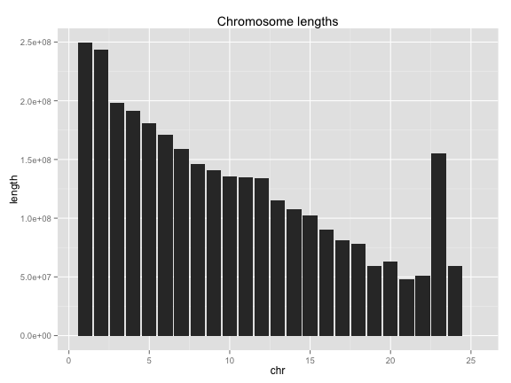
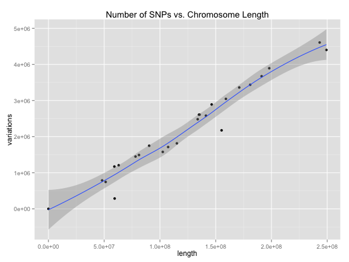

# HSL R Demo: Reproducible Research with R and Markdown

## This is a major heading

This is some plain text.

### This is a minor heading

More plain text.

## Formatting

This is an R Markdown document. Markdown is a simple formatting syntax for authoring documents. Text you type here will appear as text in the report that's produced. 

Formatting is easy. This is **bold text**, this is *italic text*, and this is `fixed-width text`. 

* This is a bulleted list.
  * This is a sub-bullet
  * Another sub-bullet
* This is another bullet.

Create blockquotes with the ">" character: 

> IT WAS the best of times, it was the worst of times, it was the age of wisdom, it was the age of foolishness, it was the epoch of belief, it was the epoch of incredulity, it was the season of Light, it was the season of Darkness, it was the spring of hope, it was the winter of despair, we had everything before us, we had nothing before us, we were all going direct to Heaven, we were all going direct the other way- in short, the period was so far like the present period, that some of its noisiest authorities insisted on its being received, for good or for evil, in the superlative degree of comparison only.

## Embedding R code inside a document.

This is a "chunk" of R code. The code is actually run, and the results are printed to the output.


```coffee
setwd("/Users/sdt5z/Dropbox/code/R/2014-03-18-HSL-R-Intro/hsl-r-repres-demo/")
```

```
## Error: cannot change working directory
```

```coffee
chromstats <- read.table("chromstats.txt", header = TRUE)
chromstats
```

```
##    chr    length variations
## 1    1 249250621    4401091
## 2    2 243199373    4607702
## 3    3 198022430    3894345
## 4    4 191154276    3673892
## 5    5 180915260    3436667
## 6    6 171115067    3360890
## 7    7 159138663    3045992
## 8    8 146364022    2890692
## 9    9 141213431    2581827
## 10  10 135534747    2609802
## 11  11 135006516    2607254
## 12  12 133851895    2482194
## 13  13 115169878    1814242
## 14  14 107349540    1712799
## 15  15 102531392    1577346
## 16  16  90354753    1747136
## 17  17  81195210    1491841
## 18  18  78077248    1448602
## 19  19  59128983    1171356
## 20  20  63025520    1206753
## 21  21  48129895     787784
## 22  22  51304566     745778
## 23  23 155270560    2174952
## 24  24  59373566     286812
## 25  25     16569        929
```

```coffee
summary(chromstats)
```

```
##       chr         length           variations     
##  Min.   : 1   Min.   :1.66e+04   Min.   :    929  
##  1st Qu.: 7   1st Qu.:7.81e+07   1st Qu.:1448602  
##  Median :13   Median :1.34e+08   Median :2174952  
##  Mean   :13   Mean   :1.24e+08   Mean   :2230347  
##  3rd Qu.:19   3rd Qu.:1.59e+08   3rd Qu.:3045992  
##  Max.   :25   Max.   :2.49e+08   Max.   :4607702
```


We're back in plain text world here. 

You can also embed plots, for example:


```coffee
library(ggplot2)
```

```
## Loading required package: methods
```

```coffee
qplot(chr, length, geom = "bar", data = chromstats, stat = "identity", main = "Chromosome lengths")
```

 

```coffee
qplot(length, variations, data = chromstats, main = "Number of SNPs vs. Chromosome Length") + 
    geom_smooth(method = "loess")
```

 

